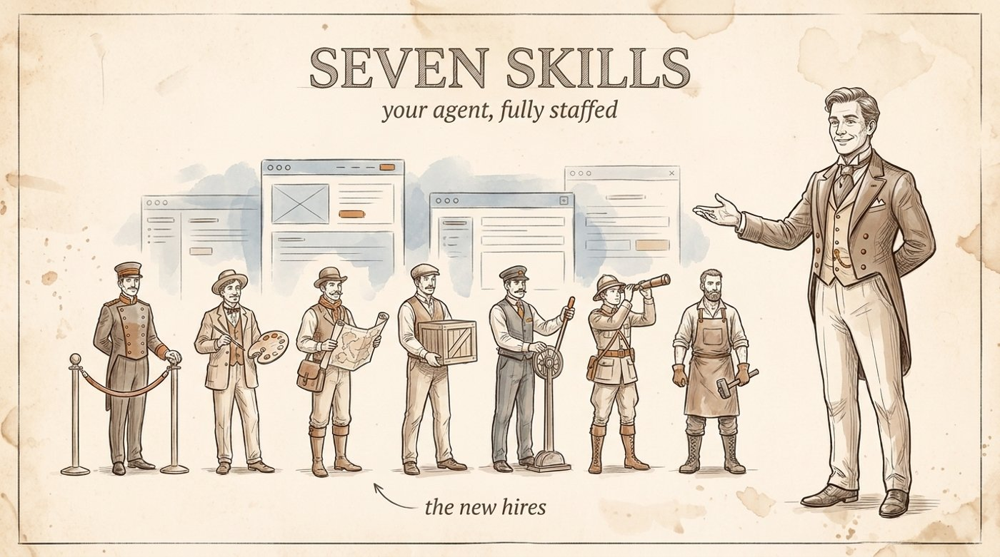

# The Seven Skills

**Stop installing skills. Start hiring them.**

Skills are hires. Most people install 100 interns and wonder why the office is chaos. These are 7 employees for your agent (Claude Code or Hermes Agent), each one earning its seat: judgment → taste → understanding → its own computer → economics → initiative → self-creation.



## The team

| # | Hire | Folder | What it does |
|---|------|--------|--------------|
| 1 | **The Bouncer** | [`bouncer/`](bouncer/) | Audits ANY skill before install: footprint, overlap, hidden instructions, cost. Proactive: once installed, nothing gets in without passing the five gates. |
| 2 | **The Art Director** | [`art-director/`](art-director/) | Locks your taste into everything the agent ships. One dispatcher + reference modules loaded on demand. |
| 3 | **The Cartographer** | [`graphify/`](graphify/) | Anything → knowledge graph. The agent queries the map instead of re-reading files. |
| 4 | **Moving Day** | [`moving-day/`](moving-day/) | One command moves the agent to a Linux VPS that never sleeps: harden, install, systemd, watchdog, Telegram. |
| 5 | **The Dispatcher** | [`route/`](route/) | Routes every job to the cheapest model that can actually do it. Frontier for thinking, budget for grunt work. |
| 6 | **The Dreamer** | [`dreamer/`](dreamer/) | Thinks about your day (email, calendar, notes, activity) while you sleep. Morning prescriptions. |
| 7 | **The Professor** | [mattpocock/skills](https://github.com/mattpocock/skills) | The final hire teaches the boss: Matt Pocock's 198k★ pack (Grill Me · Caveat · Teach Me). Not ours — that's the point. |
| + | **Bonus: Agent Reach** | [Agent-Reach](https://github.com/Panniantong/Agent-Reach) | Eyes on the whole internet, 63k★. |

## Install a skill

```bash
git clone https://github.com/ItsssssJack/seven-skills
cp -r seven-skills/bouncer ~/.claude/skills/
```

Install the Bouncer FIRST. Then let it vet the rest, and everything else you ever install.

## The Daily Driver Test

A skill earns its seat by scoring on five checks:

1. **Fires daily** — if it didn't run this week, it's shelf-ware
2. **Earns its tokens** — value out > tokens in, under ~15KB
3. **Runs without you** — no babysitting
4. **Compounds** — today's output improves tomorrow's run
5. **Survives an audit** — you know what it reads, where it sends, what it costs

5/5 daily driver · 4 keep · 3 one-week trial · ≤2 delete.

## ⚠️ The honeypot

[`honeypot-viral-thumbnail-generator/`](honeypot-viral-thumbnail-generator/) is a deliberately booby-trapped DEMO skill: oversized, trigger-colliding, with a planted hidden instruction and an encoded blob. It exists to demonstrate the Bouncer catching all four sins. **Never install it.** (The "exfil endpoint" inside it is fake and resolves nowhere.)

---

Built for the video by [AI Automations with Jack](https://www.youtube.com/@AIAutomationswithJack). Moving Day builds on the community VPS-mode work for Claude OS, and the Art Director distills principles from the giants: ui-ux-pro-max-skill, taste-skill, hallmark, make-interfaces-feel-better.
